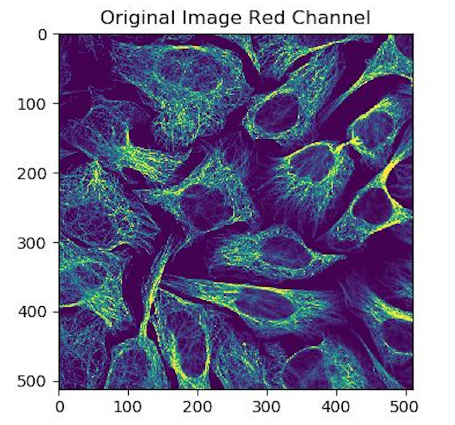
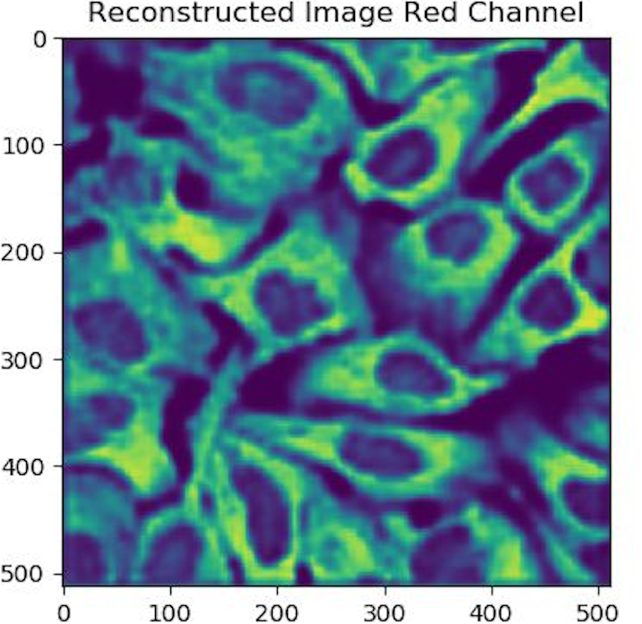

Human Protein Atlas Image Classification
===========
 

Orininal protein image (left) vs Auto-encoder reconstructed protein image (right) 

Description 
===========
This is project Human Protein Atlas Image Classification developed by team MLIP-GROUP composed of Chenghao, Changtai, Huaqing, Haotian.

Convolutional Neural Network (CNN) has been widely used for computer vision tasks like image classification, object localization (bounding box) and image segmentation today.  CNN’s abilities to extract features in the image,  making the trade-off between globalization and localization and fast parallel computing make it one of the best option for the computer vision task. Auto Encoder (AE), on the other hand, was also a very well studied method not only to reduce the6dimensionality but also to learn the distribution of the data. Therefore, one may wonder can we combine the AE and CNN to gain a better representation of the data? This project aims to find out whether a CNN based AE can benefit the image classification task.

Requirements 
============
This project is developed with **Python codes v3 and using Keras** as main deep-learning framework for autoencoder based approach and **Python codes v2 PyTorch** as the main deep-learning framework for the resnet based approach. 

Most of the following packages are already installed on DSMLP, if any is missing, please install. 
Install package 'sklearn, keras, numpy, cv2, matplotlib, pandas, torch' as follow: 

`$ pip install --user sklearn keras numpy opencv-contrib-python matplotlib pandas torch`

Classification Demo  
=================

### Demo with auto-encoder appraoch demo-launch-py3torch-gpu.ipynb
Please use **launch-py3torch-gpu.sh** to run the demo of auto-encoder approach. 
```
demo-launch-py3torch-gpu.ipynb -- Run a demo of our auto-encoder approach.
```
You will see the log like this, it could take some time since we **trained 28 models** for each type of protein. 
```
loading data
pridicting
loading model 0
loading model 1
loading model 2
loading model 3
loading model 4
loading model 5
loading model 6
loading model 7
loading model 8
loading model 9
loading model 10
loading model 11
loading model 12
loading model 13
loading model 14
loading model 15
loading model 16
loading model 17
loading model 18
loading model 19
loading model 20
loading model 21
loading model 22
loading model 23
loading model 24
loading model 25
loading model 26
loading model 27
Predicted labels: 
['1', '0', '0', '0', '0', '0', '0', '0', '0', '0', '0', '0', '0', '0', '0', '0', '0', '0', '0', '0', '0', '0', '0', '0', '0', '0', '0', '0']
Expected labels:  [1 0 0 0 0 0 0 0 0 0 0 0 0 0 0 0 0 0 0 0 0 0 0 1 0 0 0 0]

Accuracy: 96.42857142857143%
```

### Demo with CNN appraoch demo-launch-pytorch-gpu.ipynb

To run the demo of CNN approach with **launch-pytorch-gpu.sh** you have to link the training dataset under ***MLIP-GROUP*** folder

When you are in the folder MLIP-GROUP simply run the following commend.
```
ln -s /datasets/ee285f-public/human-protein
```
Make sure under the MLIP-GROUP folder there is human-protein dataset. Then simply run the following jupyter book file. 
```
demo-launch-pytorch-gpu.ipynb -- Run a demo of our CNN approach code.
```
You will see something like this, it's fast since it's only one model to load.
```
loading first sample in the test set
loading resnet18 weights
done prediction:
[1, 0, 0, 0, 0, 0, 0, 0, 0, 0, 0, 0, 0, 0, 0, 0, 0, 0, 0, 0, 0, 0, 0, 1, 0, 0, 0, 0]
accuracy: 
0.9285714285714286
```

Re-train
=================
Re-train can be done by downloading the original dataset roughly 17GB. **It can takes you days on a single GTX 1080 Ti.**

In order to retrain you need dowload the original data set from kaggel, the dataset linked in the pod won't work. 

```
train.ipynb -- Run the training of our model
```


Code organization 
=================

### .ipynb files for demo and re-train.
demo-launch-py3torch-gpu.ipynb -- Run a demo of our Auto-encoder based model. Details please see the **Classification Demo** section above.

demo-launch-pytorch-gpu.ipynb -- Run a demo of our CNN based model. Details please see the **Classification Demo** section above.

train.ipynb -- Re-run the training of our model. Details please see the **Re-train** section above.

### Assets 
assets/auto_encoder.h5 -- Trained weight for auto-encoder approach from kereas.

assets/multilayer_perceptron_models/ -- Our models trained for all types of proteins based on auto-encoder and multilayer perceptron. 

assets/ResNet18_28outputs_epoch2.pkl -- Trained weight for traditional CNN approach from based on Resnet18 from PyTorch.

assets/figures/ -- Some figures needed in the readme file.

### Code and intermediate files/moduels
code/one_hot_encoder/ -- Module for one-hot-encoder to prepare and random seperate training/validation/testing dataset.

code/auto_encoder/ -- Module implementing auto-encoder. 

code/multi_layer_perceptron/ -- Module for classify & evaluation based on auto-encoder. 

code/resnet_approach/ -- Module implementing traditional CNN appraach based on resnet18. Including train, classify and evaluation.

code/processed_data/ -- Module for one-hot-encoded training/validation/testing dataset in .npy and .txt file format.

code/raw_data/ -- Module for training data list and corresponding info given from the kaggle. Here since it's kaggle changlle, test.csv has no label info, we divided our training/validation/testing dataset from train.csv.

code/utils/ -- Module implementing some useful protien info look up data structure and functions. 

### demo, a folder of some essentail stuff for demo.


