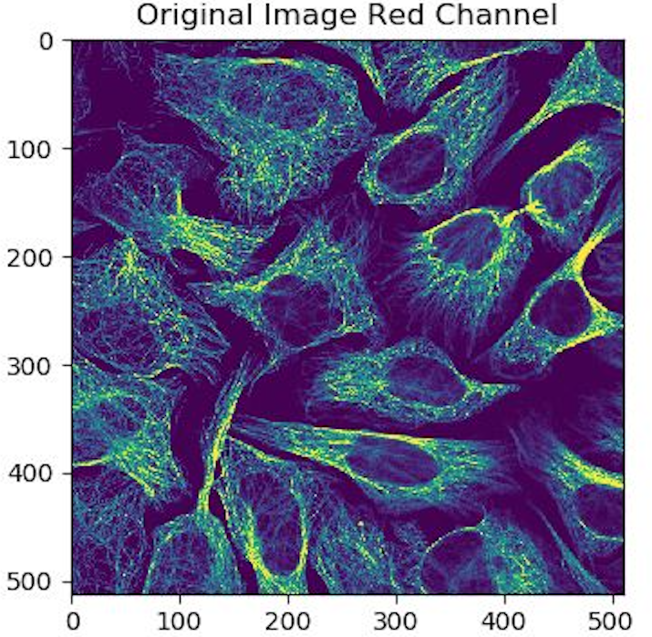

Human Protein Atlas Image Classification
===========
 

Orininal protein image (left) vs Auto-encoder reconstructed protein image (right) 

Description 
===========
This is project Human Protein Atlas Image Classification developed by team MLIP-GROUP composed of Chenghao, Changtai, Huaqing, Haotian.

Convolutional Neural Network (CNN) has been widely used for computer vision tasks like image classification, object localization (bounding box) and image segmentation today.  CNN’s abilities to extract features in the image,  making the trade-off between globalization and localization and fast parallel computing make it one of the best option for the computer vision task. Auto Encoder (AE), on the other hand, was also a very well studied method not only to reduce the6dimensionality but also to learn the distribution of the data. Therefore, one may wonder can we combine the AE and CNN to gain a better representation of the data? This project aims to find out whether a CNN based AE can benefit the image classification task.

Requirements 
============
This project is developed with Python codes v3, using Keras as main deep-learning framework for autoencoder based approach and PyTorch as the main deep-learning framework for the resnet based approach. 

Most of the following packages are already installed on DSMLP, if any is missing, please install. 
Install package 'sklearn, keras, numpy, cv2, matplotlib, pandas, torch' as follow: 

`$ pip install --user sklearn keras numpy opencv-contrib-python matplotlib pandas torch`


Classification Demo  
=================
```
demo.ipynb -- Run a demo of our code. **TODO**
```
launch-py3torch-gpu-cuda9.sh

Re-train
=================
Re-train can be done by downloading the original dataset roughly 17GB. **It can takes you days on a single GTX 1080 Ti.**

### Download Original Training Dataset
In order to retrain, first 

```
train.ipynb -- Run the training of our model (as described in Section 2)  **TODO**
```


Code organization 
=================

### .ipynb files for demo and re-train.
demo.ipynb -- Run a demo of our project. Details please see the **Classification Demo** section above.

train.ipynb -- Re-run the training of our model. Details please see the **Re-train** section above.

### Assets 
assets/auto_encoder.h5 -- Trained weight for auto-encoder approach from kereas.

assets/multilayer_perceptron_models/ -- Our models trained for all types of proteins based on auto-encoder and multilayer perceptron. 

assets/ResNet18_28outputs_epoch2.pkl -- Trained weight for traditional CNN approach from based on Resnet18 from PyTorch.

assets/figures/ -- Some figures needed in the readme file.

### Code and intermediate files/moduels
code/one_hot_encoder/ -- Module for one-hot-encoder to prepare and random seperate training/validation/testing dataset.

code/auto_encoder/ -- Module implementing auto-encoder. 

code/multi_layer_perceptron/ -- Module for classify & evaluation based on auto-encoder. 

code/resnet_approach/ -- Module implementing traditional CNN appraach based on resnet18. Including train, classify and evaluation.

code/processed_data/ -- Module for one-hot-encoded training/validation/testing dataset in .npy and .txt file format.

code/raw_data/ -- Module for training data list and corresponding info given from the kaggle. Here since it's kaggle changlle, test.csv has no label info, we divided our training/validation/testing dataset from train.csv.

code/utils/ -- Module implementing some useful protien info look up data structure and functions. 


